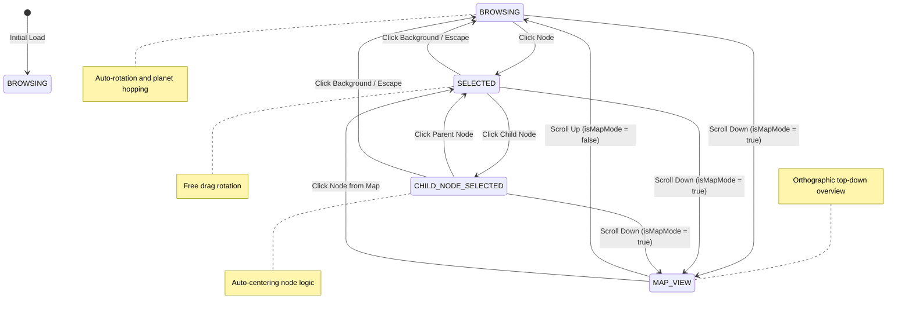

# Skill Tree Interaction State Machine

Below is a diagram representing how the application currently regulates interaction via our distinct states. The system relies on a primary string variable (`window.APP_STATE`) and a secondary boolean context modifier (`isMapMode`).

This document uses [Mermaid.js](https://mermaid.js.org/) to render the state machine diagram. Most code editors (like VS Code, via the "Markdown Preview Mermaid Support" extension) and repositories (like GitHub/GitLab) will natively render this graph!

